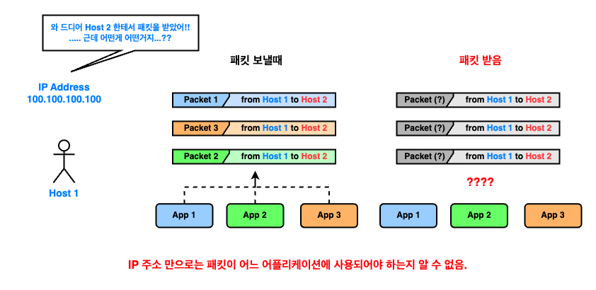

# Section 02 - 인터넷 네트워크

인터넷에서 두 컴퓨터는 어떻게 통신할까?

인터넷은 우리 일상 저변에 널리 사용된다. 인터넷을 통해 학교에 있는 친구와 채팅을 주고받을 수도 있고, 지구 반대편에 위치한 서버에 접속할 수도 있다.

그런데 이러한 통신 과정은 도대체 어떻게 일어나는 걸까?

도대체 어떤 마법을 부렸길레 친구와의 채팅이 손상되지도 않고 올바르게 전송될 수 있는 걸까?

이를 알기 위해선 먼저 인터넷 프로토콜, IP 에 대해 알아야 한다.

---

## IP : _Internet Protocol_

1969 년, 국제 인터넷 표준화 기구인 [_IETF , Internet Engineering Task Force_](https://www.ietf.org/) 는 인터넷을 개발하고 사용하기 위한 핵심 절차와 기술을 정립한 [_RFC, Request For Comment_](https://www.rfc-editor.org/) 를 출간했다.

RFC 는 그 목적에 따라 지금까지 다양한 인터넷 기술들이 저술되어 있는데, 여기에는 우리가 설명할 _IP 프로토콜_ 도 포함되어 있다.

[RFC 791](https://www.rfc-editor.org/info/rfc791) 에 따르면, _**"인터넷 프로토콜은 패킷 교환 기반의 컴퓨터 통신 네트워크를 위해 설계" [[1]](#reference)**_ 되었으며, _**"데이터의 소스와 목적지는 고정된 길이 주소로 식별된다" [[2]](#reference)**_ 고 한다.

위 설명 중 _**고정된 길이 주소**_ 가 우리가 흔히 들어본 _**IP 주소**_ 이다.

결국 IP 프로토콜은 _**IP 주소를 기반으로 "패킷 교환 네트워크" 에서 정보를 주고받는 규약**_ 인 것이다.

---

### 패킷 교환 네트워크?

그런데 위에서 말한 _**"패킷 교환 네트워크"**_ 는 뭘까? 이를 알기 위해선 먼저 _**패킷 교환**_ 을 알아야 한다.

_**패킷 교환, Packet Switching**_ 은 컴퓨터 네트워크 통식 방식 중 하나로, **데이터를 _패킷 (packet)_ 이라는 작은 단위로 나눠 데이터를 전송하는 동만 네트워 자원을 사용하는 통신 방법 [[3]](#reference)** 이다.

- [Packet Switching : Wikipedia](https://en.wikipedia.org/wiki/Packet_switching#/media/File:Packet_Switching.gif)

<!-- packet-switching.gif -->

  

위 그림을 보면 이해가 편할것이다.

먼저 그림의 `Node` 가 뭔지 알아보자. _노드_ 혹은 _패킷 교환 노드_ 는 _**패킷 교환 네트워크에서 데이터 (패킷) 의 제어, 송수신, 라우팅을 담당하는 장비** [[4]](#reference)_ 를 지칭한다. 이는 집에서 흔히 볼 수 있는 공유기, 지역 네트워크 중앙국 등이 될 수 있다.

우리의 데이터는 노드간 패킷 교환을 통해 목적지로 전송되며, **어느 패킷이 여행하는 _경로 (Route or Path)_ 는 사용되는 _라우팅 알고리즘 ([Routing Algorithm](https://en.wikipedia.org/wiki/Routing#Topology_distribution))_ 에 따라 변할 수 있다.**

즉, _패킷 교환 네트워크_ 는 결국 **"패킷 교환 방식" 을 이용한 데이터 전송 네트워크"** 일 뿐이다.

여담으로 환경에 따라 다르지만 대게 한 패킷의 크기는 `1500 byte` 로 통용되며 패킷 내부는 아래 그림처럼 구성되어 있다.

- [IPv4 packet : Wikipedia](https://en.wikipedia.org/wiki/IPv4#/media/File:IPv4_Packet-en.svg)

<!-- ipv4-packet-structure.png -->

  

위 그림을 보면 `전송하고자 하는 데이터의 한 블럭 : Data or Payload`, `송, 수신 주소지 정보 : Source & Destination address` 등이 있는걸 볼 수 있다.

---

## IP 프로토콜의 문제점

위 내용을 토대로 IP 프로토콜은 다음처럼 정리할 수 있다.

> **데이터의 발신지와 목적지가 IP 주소로 식별되며, "패킷 교환 방식" 에 기반해 데이터가 전송되는 규칙**

즉, 데이터가 전달되는 규칙일 뿐이다.

<!-- IP-problem-0.png -->

  

하지만 위 "규칙" 만으로는 데이터가 "올바르게" 전달되기 힘든데, 그 이유는 다음과 같다.

---

### 1. 비 연결성

> 데이터를 보낼 때 목적지가 올바른지 확인할 수 없다.

<!-- IP-problem-1.png -->

  

앞서 패킷에 `패킷 소스, 목적지` 정보가 들어있는 것을 보았다. 하지만 이 둘 만으로는 `목적지가 정말로 존재하는지`, `목적지까지 패킷이 도달될 수 있는지` 는 알 수 없다.

`Host 1` 의 입장에선 패킷이 잘 도착하길 기도하는 수 밖에 없는 것이다.

---

### 2. 비 신뢰성

> 목적지에 패킷이 올바르게 전달됬는지 확인할 수 없다.

<!-- IP-problem-2.png -->

  

패킷 교환을 설명하며 `"패킷의 여행 경로는 라우팅 알고리즘에 따라 변할 수 있다"` 고 언급했다. 여기서 라우팅 "알고리즘" 을 보고 `"알고리즘만 같으면 패킷은 모두 같은 경로를 갖지 않을까?"` 라고 생각할 수도 있지만 그렇지 않다.

노드에 사용되는 경로 탐색 알고리즘은 주변 노드간 cost 를 고려한 알고리즘이 대부분이기 때문이다.

따라서 인접한 어느 노드가 지금은 최선책일지 몰라도, 그 노드에 트래픽이 많아지거나 하면 다른 경로를 제시할 수 있다는 것이다.

---

### 3. 수신 패킷의 구분

> 패킷 정보 만으로는 어떤 요청으로 인한 패킷인지 확인할 수 없다.

<!-- IP-problem-3.png -->

  

`Host 1` 이 총 3 개의 app 을 이용한다 생각하자. 각각의 app 들은 모두 `Host 2` 로 패킷을 보냈고, 이들이 모두 성공적으로 전달되 `Host 2` 가 응답을 보냈다고 하자.

이 때 `Host 1` 은 동일하게 3 개의 패킷을 받는다. 하지만 문제는 각각의 패킷이 어느 app 에 의한 것인지 알 수 없다는 것이다.

패킷에 `패킷 소스, 목적지 IP 주소` 가 있지만, 그것 만으는 애플리케이션에서 파생된 패킷을 구분할 수 없다.

---

## 인터넷이 작동하는 방법 : 네트워크 모델

우리의 처음 질문으로 돌아가자.

> 인터넷에서 두 컴퓨터는 어떻게 통신할까?

이를 이해하기 위해 IP 프로토콜을 알아보았지만, **IP 프로토콜 만** 으로는 앞서 본 3 가지 하자가 있음을 확인하였다.

때문에 현대 인터넷은 IP 프로토콜 외에도 다양한 프로토콜이 _"서로 보조"_ 하며 동작하는데, 이를 잘 설명하는 것이 _**네트워크 모델**_ 이다.

- [OSI & TCP/IP 모델 - Wikipedia, kor](https://ko.wikipedia.org/wiki/%EC%9D%B8%ED%84%B0%EB%84%B7_%ED%94%84%EB%A1%9C%ED%86%A0%EC%BD%9C_%EC%8A%A4%EC%9C%84%ED%8A%B8#/media/%ED%8C%8C%EC%9D%BC:Application_Layer.png)

<!-- osi-and-tcp_ip-model.png -->

  

위 그림은 _네트워크 모델_ 중 잘 알려진 _**OSI 모델**_ 과 _**TCP/IP 모델**_ 의 그림이다.

> 역사적으로 두 모델 중 TCP/IP 모델이 먼저 나타났으며, 그 이후 인터넷 국제 표준화를 위해 OSI 모델이 제시되었다.
>
> 하지만 현대에 들어 OSI 모델의 포용 범위와 활용이 _현대 인터넷과 딱 맞아 떨어지지 않는다_ 인식되고 있으며, 때문에 TCP/IP 모델이 더 강력한 모델이라 받아들여진다.
>
> 또한 OSI, TCP/IP 같은 네트워크 모델은 시간에 따라 계속 발전하였으며 때문에 종종 TCP/IP 모델을 5 계층으로 설명하기도 한다.
>
> - [Internet protocol suite, Layering evolution and representation](https://en.wikipedia.org/wiki/Internet_protocol_suite#Layering_evolution_and_representations_in_the_literature)
>
> <!-- layering-evolution-for-network-model.png -->
>
> 

>   
> 

OSI, TCP/IP 와 같은 _네트워크 모델_ 은 네트워크의 종류, 목적 등에 따라 _계층화_ 하여 설명한다.

현대 인터넷과 잘 맞다고 알려진 TCP/IP 모델은 4 또는 5 계층으로 이루어져 있으며, 이는 다음 아래처럼 구성되어 있다.

- [Internet Protocol Stack - Wikipedia, kor](https://ko.wikipedia.org/wiki/%EC%9D%B8%ED%84%B0%EB%84%B7_%ED%94%84%EB%A1%9C%ED%86%A0%EC%BD%9C#/media/%ED%8C%8C%EC%9D%BC:InternetProtocolStack.png)

<!-- internet-protocol-stack.png -->

  

|               Layer                |                                      Description                                       |         Protocols         |
|:----------------------------------:|:--------------------------------------------------------------------------------------:|:-------------------------:|
|     응용 계층, _Application Layer_     |         사용자와 가장 가까운 계층으로, 네트워크를 통해 응용 프로그램 또는 Host 가 **사용하는** 통신 방법과 관련된 게층이다.         | HTTP, FTP, DNS, SMTP, etc |
|      전송 계층, _Transport Layer_      |         전송 계층은 application 간 논리적 통신을 위한 계층으로, 통신 송신자와 수신자를 연결하는 방법과 관련된 계층이다.          |       TCP, UDP, etc       |
|      인터넷 계층, _Internet Layer_      | 인터넷 계층은 한 Host 에서 다른 Host 로 정보를 전달하는 책임을 갖고 있다. 즉, 네트워크에서 데이터를 목적지로 전달하는 방법과 관련된 계층이다. |   IP (IPv4, IPv6), etc    |
| 네트워크 접속 계층, _Network Access Layer_ |   네트워크 접속 계층은 네트워크에 물리적으로 연결된 접속과 관련된 계층으로, 인접한 Host 또는 노드간 물리-논리적 통신 방법과 관련된 게층이다.    |   Ethernet, Wi-Fi, etc    |

네트워크를 통해 정보를 송신 시, 정보는 가장 상위 계층부터 시작해 하위 계층을 통과한다. 정보가 각 계층을 거치며 본래 정보 외 다른 정보가 _"덧대어"_ 지는데, 이를 _캡슐화, Encapsulation_ 이라 부르며 그 반대의 것을 _역캡슐화, Decapsulation_ 이라 부른다.

<!-- udp_encapsulation.png -->

  

위 그림을 보면 Internet Layer 에서 IP 프로토콜에 의해 `IP Header` 가 덧붙여 지는걸 볼 수 있다.

즉, **데이터는 각 계층의 프로토콜에 의해 "보완" 되어 실제 네트워크를 탐험하는 것** 이며, IP 프로토콜은 오직 인터넷 계층의 한 프로토콜이므로 완전하지 못했던 것이다.

> TCP/IP VS Internet Protocol Suite ?
>
> TCP/IP 모델은 말 그대로 "모델" 일 뿐, 위 그림처럼 각 계층에 속한 프로토콜을 명시하진 않는다.
>
> 다만 TCP/IP 모델을 "구현한" 네트워크 모델이 있는데, 그 중 하나가 _인터넷 프로토콜 스위트, Internet Protocol Suite_ 이다.
>
> 영문 _Suite_ 는 _모음, 모음집_ 이라는 뜻으로, Internet Protocol Suite 는 TCP/IP 모델 계층별 프로토콜을 모아둔 _"구현 모델"_ 인 것이다.

---

## Re: "인터넷에서 두 컴퓨터는 어떻게 통신할까?"

앞서 공부한 내용을 정리하자.

우리는 **"인터넷에서 두 컴퓨터는 어떻게 통신할까?"** 를 대답하기위해 IP 프로토콜이 무엇인지 공부하였고, **IP 프로토콜 만으로는 인터넷을 할수 없는 이유 3 가지** 를 확인하였다.

때문에 현대 인터넷은 _OSI, TCP/IP 모델_ 등의 _네트워크 모델_ 위에서 작동하며, _계층별 데이터 캡슐화_ 를 통해 프로토콜간 상호 보완을 이뤄낸다.

이들을 통해 우리의 첫번째 질문에 답해보자.

> **"인터넷에서 두 컴퓨터는 어떻게 통신할까?"**
>
> 현대 인터넷은 _TCP/IP 모델_ 같은 _계층화된 네트워크 모델_ 을 전제로 작동한다.
>
> 컴퓨터 A 에서 B 로 데이터를 보낼 시 _(통신할 시)_ 데이터는 사용되는 _네트워크 모델_ 의 각 계층을 통과한다.
>
> 데이터가 각 계층을 통과할 시, 계층별 사용되는 프로토콜에 의해 _캡슐화_ 되고, 일련의 캡슐화를 통해 우리의 데이터는 올바르게 B 에게 전달될 수 있다.

이를 정리하면 _**네트워크 모델 계층별 캡슐화를 통해 인터넷이 올바르게 작동**_ 한다는 것이며, 이는 _**캡슐화가 IP 프로토콜의 3 가지 하자를 보완**_ 함을 암시한다.

아니 그럼 도대체 무슨 데이터를 더 넣길래 _캡슐화_ 만으로 _IP 의 3 가지 하자_ 가 해결된다는 것일까?

---

## TCP : Protocol From Transport Layer

앞서 IP 프로토콜은 TCP/IP 모델의 제 2 계층, 인터넷 계층에 속한 프로토콜 임을 보았다.

때문에 _IP 프로토콜의 하자_ 는 그 상위에 있는 계층 프로토콜에 의해 보완될 수 있으며, 강의는 이 보완책으로 _TCP_ 프로토콜을 설명한다.

---

### TCP - 3 Way Handshake

_TCP_ 는 _Transmission Control Protocol_ 의 약어로, 직역하면 _전송 제어 프로토콜_ 이다.

TCP 는 앞서 본 TCP/IP 모델의 제 3 계층, 전송 계층에 속한 프로토콜이며, _`TCP/IP 모델`_ 의 이름에 붙을 정도로 널리 사용되는 프로토콜이다.

TCP 프로토콜은 역사적으로 두 컴퓨터간 통신을 "신뢰할 수 있음을 보장" 하기 위해 나타났다. 때문에 그 작동 방식 또한 컴퓨터간 통신이 유효한지 확인하는데 중점을 둔다.

TCP 프로토콜의 작동은 크게 세 가지 흐름으로 구분한다.

1. 연결 생성, _Connection establishment_
2. 자료 전송, _Data transfer_
3. 연결 종료, _Connection termination_

강의는 이 중 연결 생성 과정에 집중적으로 설명하고 있으며, 때문에 자료 전송, 연결 종료 설명은 생략하도록 하겠다.

> 좋은 설명 자료
> 
> 1. 자료 전송
>  - [이해하면 인생이 바뀌는 TCP 송/수신 원리 - 널널한 개발자 TV, youtube channel](https://www.youtube.com/watch?v=K9L9YZhEjC0)
>  - [[네트워크 기초 강의] 32강. TCP 의 오류·흐름·혼잡 제어 - 한빛미디어, youtube channel](https://www.youtube.com/watch?v=zEZbCULOQdY&list=PLVsNizTWUw7HfOCgvlfHIDPPo3TE-2iQM&index=36)
>
> 2. 연결 종료
>  - [[네트워크 기초 강의] 31강. TCP 와 UDP - 한빛미디어, youtube channel](https://www.youtube.com/watch?v=d6pUy1Z56h8&list=PLVsNizTWUw7HfOCgvlfHIDPPo3TE-2iQM&index=34)

TCP 프로토콜의 연결 생성은 _3 방향 핸드셰이크, 3 Way Handshake_ 를 통해 이루어진다.

- [3 Way Handshake - Wikipedia, kor](https://ko.wikipedia.org/wiki/%EC%A0%84%EC%86%A1_%EC%A0%9C%EC%96%B4_%ED%94%84%EB%A1%9C%ED%86%A0%EC%BD%9C#/media/%ED%8C%8C%EC%9D%BC:Tcp-handshake.svg)

<!-- tcp-3-way-handshake.png -->

  

1. `(client --> server)` SYN
2. `(server --> client)` SYN + ACK
3. `(client --> server)` ACK

3 방향 핸드셰이크는 일련의 `SYN`, `ACK` 를 통해 `Client <--> Server` 간 통신이 가능한지 확인한다. 클라이언트와 서버는 `SYN` 신호를 통해 서로의 존재를 확인하고 그에 대한 응답으로 `ACK` 를 보낸다.

즉, **3 방향 핸드셰이크를 통해 서로 정말로 존재하는지 검증할 수 있고, 그 사이 통신 또한 어느정도 유효하다 인정할 수 있는 것이다.**

따라서 TCP 의 3 방향 핸드셰이크는 [**IP 프로토콜의 첫번째 문제점, 비 연결성**](#1-비-연결성) 을 보완한다.

---

### TCP - Encapsulation

TCP 의 헤더 구조, 즉 _캡슐화_ 되는 형태는 다음과 같다.

- [TCP header format - Wikipedia](https://en.wikipedia.org/wiki/Transmission_Control_Protocol#TCP_segment_structure)

<!-- tcp-header-format.png -->

  

이를 이전 [IPv4 패킷 구조](#패킷-교환-네트워크) 와 같이 살펴보자.

<!-- ipv4-packet-structure.png -->

  

TCP 로 인해 캡슐화 되는 정보는 IPv4 패킷 구조의 `Protocol` 에 들어간다.

또한 TCP 헤더를 보면 `Port`, `Number`, 그리고 앞서 말한 `SYN`, `ACK` 를 볼 수 있다.

여기서 **`Port` 는 네트워크 서비스나 특정 프로세스를 식별하기 위한 논리 단위** 로, `0 ~ 65,535` 범위의 한 숫자로 표현 가능하다. (`16 bit` 이므로 $2^{16} = 65,536$ 개의 번호를 식별 가능.)

> Port 번호
> 
> 포트 번호는 크게 세 종류로 구분된다.
> 
> - `0 ~ 1023` : _잘 알려진 포트, well-known port_
> - `1024 ~ 49,151` : _등록된 포트, registered port_
> - `49,152 ~ 65,535` : _동적 포트, dynamic port_
> 
> [TCO, UDP 포트 번호들 - Wikipedia](https://en.wikipedia.org/wiki/List_of_TCP_and_UDP_port_numbers)
> 
> 각 포트 종류에 따른 설명은 다음과 같다. [[5]](#reference)
> 
> _잘 알려진 포트_ 는 시스템 프로세스 또는 네트워크 서비스를 위해 주로 사용되는 포트로, 우리가 쉽게 건드리지 않는 것이 좋은 포트 번호들이다.
> 
> _등록된 포트_ 는 _[인터넷 할당 번호 관리기관, IANA](https://ko.wikipedia.org/wiki/IANA)_ 가 명시하는 포트 번호이다. IANA 는 여러 기관의 요청에 따라 그들의 서비스별 포트 번호를 공식적으로 명시해 준다. 때문에 이들을 반드시 지키야 할 의무는 없지만, 다른 사용자의 원활한 사용을 위해 지키는게 좋은 포트 번호들이다. 
> 
> 마지막으로 _동적 포트_ 는 IANA 가 명시할 수 없는 포트 번호로 우리 마음대로 할 수 있는 번호들이다. 비공개 서비스 제공을 위해 사용되기도 하며 임시 포트 개방으로도 사용된다.

포트 번호의 정의에 따라 TCP 의 `Source Port`, `Destination Port` 를 통해 **현재 주고받은 데이터가 어떤 app 에 사용되는지 명시** 할 수 있다.

즉, **포트 번호를 통해 [IP 프로토콜의 세번째 문제점, 수신 패킷의 구분](#3-수신-패킷의-구분) 를 해결할 수 있다.**

마지막으로 `Seqeunce Number`, `Acknowledgement Number` 는 **수신 데이터의 순서를 확인** 하기 위한 데이터로, 서버에 모든 데이터가 순서에 맞게 전달되었는지 검증하는데 사용된다.

즉, **위 `Number` 를 통해 [IP 프로토콜의 두번째 문제점, 비 신뢰성](#2-비-신뢰성) 을 해결할 수 있다.**

---

### TCP 프로토콜의 특징

우리는 지금까지 TCP 프로토콜이 IP 프로토콜을 어떻게 보완하는지 확인하였다.

IP 프로토콜의 문제점은 결국 데이터를 **올바르게** 보내는데 있었다.

때문에 TCP 의 특징은 **데이터를 올바르게 보낸다** 에 초점이 맞춰져 있다.

TCP 의 특징을 나열해보자면 다음과 같다.

> 1. _연결 지향적_ 이다.
> 
>   - TCP 는 3 Way Handshake 를 통해 연결 생성한다.
>   - TCP 는 4 Way Handshake 를 통해 연결을 종료한다. 
> 
> 2. 데이터의 올바른 전달을 보장한다.
> 
>   - 포트 번호를 통해 수신 패킷을 구별할 수 있게 해준다.
>   - `Sequence Number` 등을 통해 데이터의 순서를 보장한다.
>   - 패킷 수신시 `ACK` 응답으로 패킷 도착을 상기시킨다.
>   - 양방향 송수신 _(Full-duplex Communication)_ 시 4 Way Handshake 를 통해 모든 데이터 전달 후 연결을 닫도록 보장한다.

위 설명 중 몇몇 부분은 이전에 언급한 적이 없는 설명들이다.

이들은 [좋은 TCP 설명 자료](#tcp---3-way-handshake) 를 참고해 알아보길 바란다.

---

## Summary

우리는 지금까지 많은 내용을 학습하였다.

**"인터넷에서 두 컴퓨터는 어떻게 통신할까?"** 를 답하기 위해 IP 프로토콜과 그 한계점을 파악하였고, 현대 인터넷은 네트워크 모델의 장 아래 작동됨을 확인하였다.

특히 TCP 프로토콜을 통해 IP 프로토콜의 단점 3 가지를 보완함을 확인하였고, TCP 프로토콜의 특징 또한 정리하였다.

이로서 우리 첫번째 질문에 그럴싸한 답을 만들 순 있지만, 몇몇은 이것 만으로는 부족하다 생각할 것이다.

사실 그 이유는 아주 명료한데, 우리가 지금까지 학습한 내용은 TCP/IP 모델의 1 ~ 3 계층 에만 국한되었기 때문이다.

- [패킷 교환 네트워크](#패킷-교환-네트워크) 는 제 1 계층, Network Access Layer 에 사용되는 네트워크 종류였다.
- [IP 프로토콜](#ip--_internet-protocol_) 은 제 2 계층, Internet Layer 에 사용되는 프로토콜로, 패킷 교환 네트워크에서 목적지를 IP 주소로 식별하기 위해 사용되었다.
- 마지막으로 [TCP](#tcp--protocol-from-transport-layer) 는 제 3 계층, Transport layer 에서 사용되었고, 목적지까지 데이터를 올바르게 전달함에 목적이 있었다.

아니. 이렇게 공부했는데 아직 더 남았다고?

그렇다. 게다가 그 양은 지금까지 공부한 것의 배가 될 것이다.

그만큼 Application Layer 는 웹 개발의 핵심이며 우리가 이용하는 웹 서비스가 얼마나 많은 것들 위에 구성되었는지 일깨워 줄 것이다.

다음 강의에서는 현대 인터넷에 빼놓을 수 없는 _DNS_, 그리고 본 강의의 핵심인 _HTTP_ 의 개요를 알아볼 것이다.

---

## Reference

- [RFC 791 - Internet Protocol](https://www.rfc-editor.org/info/rfc791)
    - `[1]` : The Internet Protocol is designed for use in interconnected systems of packet-switched computer communication networks. `[1.1 Motivation]`
    - `[2]` : The internet protocol provides for transmitting blocks of data called datagrams from sources to destinations, where sources and destinations are hosts identified by fixed length addresses. `[1.1 Motivation]`

- [`[3]` : 패킷 교환 - Wikipedia, kor](https://ko.wikipedia.org/wiki/%ED%8C%A8%ED%82%B7_%EA%B5%90%ED%99%98)

- [Packet-switching node - Wikipedia](https://en.wikipedia.org/wiki/Packet-switching_node)
    - `[4]` : A packet-switching node is a node in a packet-switching network that contains data switches and equipment for controlling, formatting, transmitting, routing, and receiving data packets.

- [`[5]` : What are the differences between the 3 port types? - StackExchange](https://superuser.com/questions/956226/what-are-the-differences-between-the-3-port-types)
